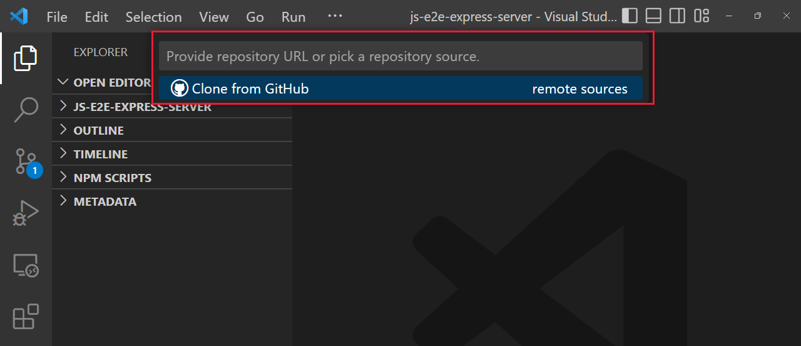

# Auto Pack Update Guide
1. First, if you don't already have it installed, download VSCode at [Visual Studio](https://code.visualstudio.com/)!
2. Once you've finished installing VSCode, open it, then press <kbd>Ctrl</kbd> + <kbd>Shift</kbd> + <kbd>P</kbd> to open the command line.
---

